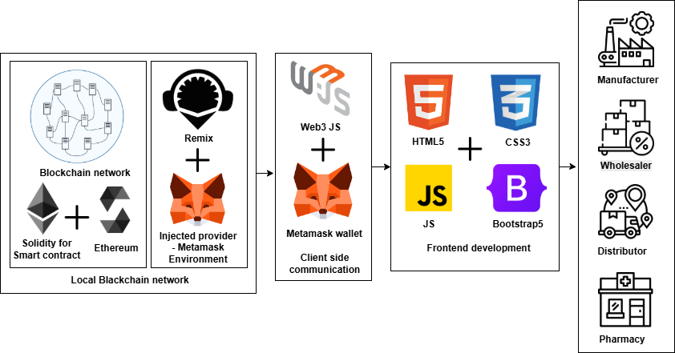

# MediChain: Blockchain-Based Pharmaceutical Supply Chain Management

## Overview

**MediChain** is a secure, transparent, and efficient blockchain-based system that transforms pharmaceutical supply chain management. Built on Ethereum, this solution provides end-to-end traceability of medical products from manufacturers to patients, eliminating counterfeit drugs and ensuring patient safety.

---

## Features

- **Secure Drug Registration**: Manufacturers can register drug production data on an immutable blockchain ledger
- **Automated Ownership Transfer**: Smart contracts facilitate secure ownership transfers between supply chain participants
- **State Management**: Track medicine status from manufacturing through distribution to sale
- **QR Code Verification**: Instant product authentication through QR code scanning
- **Decentralized Architecture**: Elimination of central authorities and single points of failure
- **Real-Time Tracking**: Monitor drug movement through the supply chain

---

## Tech Stack

- **Blockchain**: Ethereum (Private Network), Solidity
- **Frontend**: HTML, CSS, JavaScript
- **Web3 Integration**: MetaMask, Web3.js
- **Smart Contracts IDE**: Remix IDE

---
## System Architecture

MedChain consists of three integrated layers:

### 1. Blockchain Network
- Private Ethereum blockchain as the foundational database
- Solidity smart contracts for business logic automation
- Immutable record-keeping with timestamped transactions

### 2. Client Communication Layer
- Web3.js for blockchain connectivity
- User interfaces for stakeholder interactions
- MetaMask integration for secure authentication and transaction signing

### 3. Application Layer
- HTML-CSS-JavaScript frontend interface
- QR code integration for product verification
- Real-time tracking dashboard

---

## Key Modules

### 🔗 Smart Contract Operations

Smart contracts written in Solidity handle:

- `addMedicine()` – Register medicines with full traceability.
- `purchaseMedicine()` – Buy securely with automatic ownership transfer.
- `updateMedicineState()` – Update lifecycle state (e.g., Manufactured, In Stock, Sold, Expired).
- `getMedicine()`, `getMedicineState()` – Retrieve real-time product and status info.

### 🖥️ Dashboard

- Clean, professional interface modeled after modern commerce platforms.
- Track:
  - Order history
  - Total drugs registered
  - Total stock across batches
  - Total units sold
- Manufacturer insights, quantity analytics, and QR-based lookup tools.

### 🔎 Track Medicine

- Search by medicine ID to view:
  - Batch metadata
  - Manufacturer identity
  - Lifecycle state and timestamps
  - Current owner in the supply chain
- One-click **Verification Report** generation for regulators or consumers.

### 🛒 Buy Medicine

- Live search and filter system
- Detailed product cards with dynamic pricing
- Integrated blockchain validation before purchase
- Smooth transaction flow with MetaMask authentication

### 👥 User Management

- Register as Manufacturer, Distributor, or Pharmacy
- Role-based login with Ethereum identity
- All interactions are cryptographically signed

---

## Screenshots

> 🧾 Dashboard Overview  
> 

> 📦 Add Medicine  
> 

> 🔍 Track Medicine  
> 

> 🛒 Buy Medicines  
> 

---

## Performance

The system has been optimized for both performance and cost efficiency:

- **Transaction Speed**: Average response time of 100ms under 500 concurrent users
- **Gas Optimization**: Reduced transaction costs through optimized smart contracts
- **Scalability**: Designed to handle thousands of participants and millions of transactions
- **Security**: Multiple layers of protection against unauthorized access and data manipulation

---

## Future Enhancements

- [ ] **Advanced Analytics**: Implementing machine learning algorithms for risk prediction
- [ ] **Cross-Chain Integration**: Enabling interoperability with other blockchain networks
- [ ] **Expanded Verification Methods**: Adding NFC and RFID capabilities

---

## Contributors

- **Baivab Sarkar** — [@ThisIs-Developer](https://github.com/ThisIs-Developer)  
- **Ayan Chatterjee** — [@Ayan123C](https://github.com/Ayan123C)
- **Bhishmadev Ghosh** — [@bhishma620](https://github.com/bhishma620)  
- **Arpan Bhattacharya** — [@Arpan550](https://github.com/Arpan550)

---

## 📄 License

This project is licensed under the Apache 2.0 License - see the [LICENSE](LICENSE) file for details.
